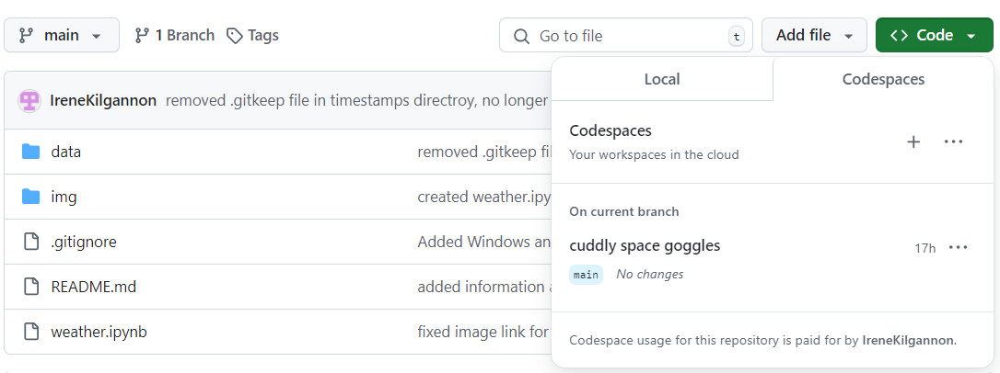
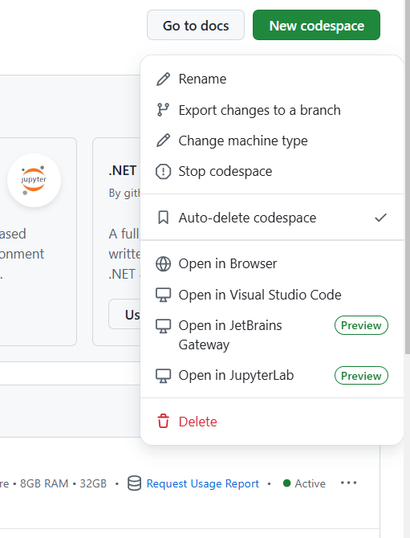

# Computer Infrastructure

Author: Irene Kilgannon

Student No: G00220627

This repository contains the assessment tasks and project for the module, Computer Infrastructure as part of the [Higher Diploma in Science in Computing in Data Analytics](https://www.gmit.ie/higher-diploma-in-science-in-computing-in-data-analytics) at [Atlantic Technological University](www.atu.ie).

## Purpose of the Module

The purpose of the assessment is to demonstrate ability in the following:

1. Use, configure, and script in a command line interface environment.

2. Manipulate and move data and code using the command line.

3. Compare commonly available software infrastructures and architectures.

4. Select appropriate infrastructure for a given computational task.

## Outline of the Tasks and Project

__Task 1: Create Directory Structure__

Using the command line, create a directory named `data` at the root of your repository. Inside `data`, create two subdirectories: `timestamps` and `weather`.

__Task 2: Timestamps__

Navigate to the `data/timestamps` directory. Use the `date` command to output the current date and time, appending the output to a file named `now.txt`. Use the ``>>`` operator to append (not overwrite) the file. Repeat this step ten times, then use the `more` command to verify that `now.txt` has the expected content.

__Task 3: Formatting Timestamps__

Run the ``date`` command again, but this time format the output using ``YYYYmmdd_HHMMSS`` (e.g., 20261114_130003 for 1:00:03 PM on November 14, 2026). Refer to the ``date`` man page (using ``man date``) for more formatting options. (Press q to exit the man page). Append the formatted output to a file named ``formatted.txt``.

__Task 4: Create Timestamped Files__

Use the ``touch`` command to create an empty file with a name in the ``YYYYmmdd_HHMMSS.txt`` format. You can achieve this by embedding your date command in backticks ` into the ``touch`` command. You should no longer use redirection (>>) in this step.

__Task 5: Download Today's Weather Data__

Change to the data/weather directory. Download the latest weather data for the Athenry weather station from Met Éireann using ``wget``. Use the ``-O <filename>`` option to save the file as ``weather.json``. The data is found at this URL: `https://prodapi.metweb.ie/observations/athenry/today`.

__Task 6: Timestamp the Data__

Modify the command from Task 5 to save the downloaded file with a timestamped name in the format ``YYYYmmdd_HHMMSS.json``.

__Task 7: Write the Script__

Write a bash script called ``weather.sh`` in the root of your repository. This script should automate the process from Task 6, saving the weather data to the ``data/weather`` directory. Make the script executable and test it by running it.

__Task 8: Notebook__

Create a notebook called ``weather.ipynb`` at the root of your repository. In this notebook, write a brief report explaining how you completed Tasks 1 to 7. Provide short descriptions of the commands used in each task and explain their role in completing the tasks.

__Task 9: pandas__

In your ``weather.ipynb`` notebook, use the pandas function ``read_json()`` to load in any one of the weather data files you have downloaded with your script. Examine and summarize the data. Use the information provided [data.gov.ie](data.gov.ie) to write a short explanation of what the data set contains.

### __Project__

Automate the ``weather.sh`` script to run daily and push the new data to your repository. The following steps will create the necessary ``GitHub Actions workflow``.

__Step 1: Create a GitHub Actions Workflow__
  
In the repository, create a folder called ``.github/workflows/`` (if it doesn't already exist). Inside this folder, create a file called ``weather-data.yml``.

__Step 2: Run Daily at 10am__

  Use the ``schedule`` event with ``cron`` to set the script to run once a day at 10am. Include also the ``workflow_dispatch`` event so you can test the workflow.

__Step 3: Use a Linux Virtual Machine__

  In the workflow file, specify that a Ubuntu virtual machine should be used to run the action.

__Step 4: Clone the Repository__

  Have the workflow clone your repository.

__Step 5: Execute the ``weather.sh`` Script__ 
  
  Add a step that runs your ``weather.sh`` script.

__Step 6: Commit and Push Changes Back to the Repository__ 
  
  Configure the workflow to commit the new weather data and push those changes back to your repository.

__Step 7: Test the Workflow__
  
  Commit and push the workflow to your repository. Check the logs in GitHub to ensure that the ``weather.sh`` script runs correctly, that new data is being committed.

## Contents of this repository

The repository contains the following directories and files:

|Repository root |Subdirectory |File name |
|---|--- |--- |
|data |weather | |
| |timestamps | now.txt|
| | |formatted.txt |
|||20241022_124153.txt|
|img |-|.png files|
|.gitignore | | |
|README.md | | |
|weather.ipynb | | |
|weather.sh | | |

## Installation

1. Download and install [Anaconda](https://www.anaconda.com/download). Anaconda is a Python distribution and comes with pre-installed packages. Please note that when installing Anaconda it is important to check the two boxes for:
  * Add Anaconda3 to my PATH environment variable.
  * Register Anaconda3 as my default.
  

2. Download and install [Visual Studio Code](https://code.visualstudio.com/).

3. Download and install [git](https://git-scm.com/downloads).

3. Create a [GitHub account](https://github.com). The command line of [GitHub Codespaces](https://github.com/features/codespaces) will be used for the tasks and project.

4. Open Cmder (or the terminal in VSCode) and enter the following to clone the repository from GitHub onto your own machine:
  
    ``git clone https://github.com/IreneKilgannon/computer_infrastructure.git``

## Access GitHub Codespaces

New codespaces can be accessed in two ways in your GitHub account:

* From the side bar, as shown in the image below. 

Clicking on Codespaces, will bring you into a window that displays any codespaces that you have created. Clicking on the green 'New codespace' will create a new codespace in your repository. 

* Directly from the repository. In a directory, click on the green green code button, followed by Codespaces. Clicking ``Create codespace on main`` will create a new codespace. Created codespaces can also be accessed from here too.

When you are finished working in the codespaces, it is important to disconnect the codespace as it will continue running until it times out due to inactivity. Charges could be incurred unless it is disconnected. Closing the browser tab does not stop the codespace.

Tip: If you are switching between the virtual machine on GitHub Codespaces to working on your local machine, in the computer_infrastructure directory perform a ``git pull`` in either the terminal of VSCode or
Cmder.

[Quickstart for GitHub codespaces](https://docs.github.com/en/codespaces/getting-started/quickstart)

## Dependencies

requirements.txt in the root of the repository contain the dependencies for this repository. Currently there are no dependencies. 

## Get Help

If you have any questions or queries you can contact me at g00220627@atu.ie or alternatively [submit an issue](https://github.com/IreneKilgannon/computer_infrastructure/issues).

