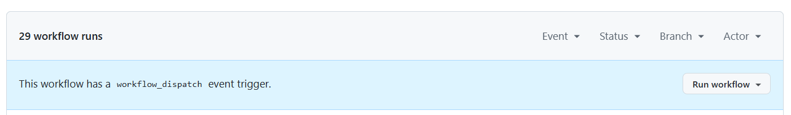

# Computer Infrastructure


This repository has the assessment tasks and project for the module, Computer Infrastructure as part of the [Higher Diploma in Science in Computing in Data Analytics](https://www.gmit.ie/higher-diploma-in-science-in-computing-in-data-analytics) at [Atlantic Technological University](www.atu.ie).

## Purpose of the Module

The purpose of the assessment, as described in the GitHub repository for [Computer Infrastructure](https://github.com/ianmcloughlin/2425_computer_infrastructure) is to demonstrate ability in the following:

1. Use, configure, and script in a command line interface environment.

2. Manipulate and move data and code using the command line.

3. Compare commonly available software infrastructures and architectures.

4. Select the appropriate infrastructure for a given computational task.

## Outline of the Tasks and Project

The tasks and the project are described by the lecturer, Ian McLoughlin in the [Computer Infrastructure README](https://github.com/ianmcloughlin/2425_computer_infrastructure/blob/main/README.md) for the Computer Infrastructure repository on GitHub. 

The assessment involves extensive use of the command line interface in GitHub Codespaces. 

The overall aim of the tasks is to create a bash script, weather.sh that downloads weather information from the Athenry weather station. All the necessary steps to achieve this, from the basics of creating files, directories, and timestamped files to writing a bash script, are documented in `weather.ipynb`. 

The project involves creating a GitHub Actions workflow using the bash script, weather.sh, and automating it so that the weather data from the Athenry weather stations is downloaded at 10 am every day. The project is documented in this README.

The final component of the assessment is an organized repository with a clear README and suitable .gitignore. GitHub Issues was used to plan the work for each task. 

## Contents of this repository

The repository has the following directories and files:

|Repository root |Subdirectory |Contents |
|---|--- |--- |
|data |weather |Weather data |
| |timestamps | .txt files|
|img |-|.png image files|
|.gitignore | |File that git should ignore |
|README.md | |Description of the repository and the project |
|weather.ipynb | |Description of the assessment tasks |
|weather.sh | |Bash script |
|requirements.txt | |Empty, can be used if any dependencies arise |

## Installation

To run the file on your local system, the following must be downloaded and installed.

1. Download and install [Anaconda](https://www.anaconda.com/download). Anaconda is a Python distribution and comes with pre-installed packages. Please note that when installing Anaconda, it is important to check the two boxes for:
  * Add Anaconda3 to my PATH environment variable.
  * Register Anaconda3 as my default.
  


2. Download and install [Visual Studio Code](https://code.visualstudio.com/).

3. Download and install [git](https://git-scm.com/downloads).

4. Install [Cmder](https://cmder.app/)

5. Create a [GitHub account](https://github.com). 

6. Open Cmder (or the terminal of Visual Studio Code) and enter the following to clone the repository from GitHub to your local machine:
  
    `git clone https://github.com/IreneKilgannon/computer_infrastructure.git`

## How to Use This Repository

After cloning the repository, GitHub Codespaces can be used to replicate the tasks part of the assignment. Some of the commands used will not run in a Windows environment. 

The project is run with GitHub Actions. In GitHub Actions, select Daily Weather Data Script and click 'Run workflow" to trigger the workflow manually. 

# Create a GitHub codespace.

[GitHub Codespaces](https://github.com/features/codespaces) uses Visual Studio Code in a Linux environment. The terminal of Visual Studio Code within GitHub Codespaces was used for the tasks. 

* In your GitHub account, create a GitHub repository. GitHub has a short guide on how to [create a new repository](https://docs.github.com/en/repositories/creating-and-managing-repositories/quickstart-for-repositories).

There are several ways to create a new codespace in your GitHub repository. 

* From the sidebar, as shown in the image below. 


Clicking on Codespaces will bring you to a window that displays any codespaces that have been created. Clicking on the green 'New codespace' will create a new codespace in your repository. 

* Directly from the repository. Click on the green code button, followed by the Codespaces tab. Clicking `Create codespace on main` will create a new codespace. Created Codespaces can be accessed from here too.


When you are finished working in the codespace, it is important to disconnect the codespace. It will continue running until it times out due to inactivity. Charges could be incurred if it is not disconnected. Closing the browser tab does not stop the codespace.


Tip: If you are switching between the virtual machine on GitHub Codespaces to your local machine, in either the terminal of VSCode or Cmder perform a `git pull` in the computer_infrastructure directory. Also, after a new JSON file has been pushed by GitHub Actions to the repository, a `git pull` is needed to sync GitHub Codespaces with the repository.

[Quickstart for GitHub codespaces](https://docs.github.com/en/codespaces/getting-started/quickstart)

## Dependencies

Currently, no special packages or libraries are required. Any dependencies will be added to `requirements.txt` which is at the root of the repository.

## Project

Project brief: Automate weather.sh to run daily at 10 am and push the new data to my repository. 

### Introduction

GitHub Actions was used to carry out this project. GitHub Actions is a cloud-based automation platform that allows developers to set up workflows to automate tasks. An event triggers a workflow and depending on the event a workflow will be triggered. For example, a workflow could be triggered by a pull or push request to a repository. Every time something happens in your repository, automatic actions could be executed in response. 

GitHub Actions simplifies tasks for the developer. GitHub manages the infrastructure and gives the developer the environment they need without having to install it on their local computer. It integrates with other technologies - workflows can be run on Linux, Windows, or macOS.  In addition, multiple jobs can be run at the same time as each job in a workflow runs in a fresh virtual environment.

Workflows are defined using YML files or YAML files. [IBM.com](https://www.ibm.com/topics/yaml) states that YML files define sequences of actions and configurations in an easily understandable form. There are workflow templates to automatically create the YML file needed. These are pre-configured and can be modified by the developer to their task. 

### Steps to Complete the Project

The following steps were carried out:

- In the repository, the .github/workflows directory and subdirectory were created. The file, [weather-data.yml](https://github.com/IreneKilgannon/computer_infrastructure/blob/main/.github/workflows/weather-data.yml) was added to .github/workflows.

- In weather-data.yml, a GitHub Actions Workflow was created. 

```yml
name: Daily Weather Data Script
```

name:  Describes what the workflow is doing.

***

- __Brief:__ Run Daily at 10 am. 

Use the schedule event with cron to set the script to run once a day at 10 am. Also, include the workflow dispatch event so you can test the workflow.

  ```yml
  on:
    # Schedule the workflow to run at 10:00 AM UTC every day
    schedule:
      - cron: '0 10 * * *'

    # Allow manual triggering of the workflow
    workflow_dispatch:
  ```

on: Sets out the trigger that runs the workflow.

Workflow triggers are events that cause a workflow to run. The full list of triggers is found in the [events that trigger a workflow documentation](https://docs.github.com/en/actions/writing-workflows/choosing-when-your-workflow-runs/events-that-trigger-workflows). For this event, the [schedule trigger](https://docs.github.com/en/actions/writing-workflows/choosing-when-your-workflow-runs/events-that-trigger-workflows#schedule) is required. This triggers a workflow at a scheduled time. For this project, we want to run the event daily at 10 am. This can be done with `cron` which is suitable for scheduling repetitive tasks. 

This schematic, taken from the schedule documentation, illustrates the syntax for `cron`.

        ┌───────────── minute (0 - 59)
        │ ┌───────────── hour (0 - 23)
        │ │ ┌───────────── day of the month (1 - 31)
        │ │ │ ┌───────────── month (1 - 12 or JAN-DEC)
        │ │ │ │ ┌───────────── day of the week (0 - 6 or SUN-SAT)
        │ │ │ │ │
        * * * * *

For this workflow to run at 10 am the syntax is: 

`cron 0 10 * * *`

Adding `workflow_dispatch` allows the user to manually trigger the workflow. 

***

- __Brief:__ Use a Linux Virtual Machine

In the workflow file, specify that an Ubuntu virtual machine should be used to run the action.

```yml
jobs:
  run-weather-script:
    runs-on: ubuntu-latest
```

jobs: This groups a set of actions that will be executed.

  run-on: Select from Ubuntu, Windows, and macOS.
    All jobs can be run on Ubuntu, Windows, and macOS virtual machines. It is possible to test workflows on all three operating systems. For this project, the latest version of Ubuntu is needed. Ubuntu is a popular distribution of Linux.

***

- __Brief:__ Clone the Repository

Have the workflow clone your repository.

```yml
    steps:
    # Step 1: Checkout the repository
    - name: Checkout Repository
      uses: actions/checkout@v4
```

To build an action the first step is to check out the repository. There is a repository of predefined actions available on [github.com/actions](https://github.com/actions). The [checkout action](https://github.com/actions/checkout/tree/main) checks out the user's repository so that the workflow can access it. The version was updated to v4, which is the latest version as per the documentation. 

```yml
    # Step 2: Set up Python
    - name: Set up Python
      uses: actions/setup-python@v5
      with:
        python-version: '3.x'

```

After reviewing lecture notes this step was added to the workflow. This is the documentation on [adding setup-python](https://github.com/actions/setup-python) to a workflow. This will ensure that the latest version of Python 3 is installed.

```yml
    # Step 3: Install dependencies
    - name: Install required tools
      run: pip install -r requirements.txt
```

According to this [blog](https://www.freecodecamp.org/news/python-requirementstxt-explained/), requirements.txt is a file at the root of the repository with a list of packages or libraries needed to work on a project. For this workflow, requirements.txt is an empty file as there are no dependencies to install as `wget` is a built-in package. 

Some users `run pip freeze > requirements.txt` to write a full list of all the packages and libraries on their system to requirements.txt. This will replicate the exact package setup from one environment to another. As my workflow runs without this, this was not necessary.

***
- __Brief:__ Execute the weather.sh Script

Add a step that runs your weather.sh script.

```yml
    # Step 4: Run the weather.sh script
    - name: Execute weather.sh
      run:  bash weather.sh
```

This step executes the weather.sh script. Some yml files have an additional step here and use `chmod` to set the necessary permissions to run the script. This is not required for this workflow as the permissions were set previously as part of the assignment tasks.

- __Brief:__ Commit and Push Changes Back to the Repository

Configure the workflow to commit the new weather data and push those changes back to your repository.

```yml
    # Step 5: Commit and push changes back to the repository
    - name: Commit and push changes
      env:
        GITHUB_TOKEN: ${{ secrets.GITHUB_TOKEN }}
      run: |
        git config --global user.name "github-actions[bot]"
        git config --global user.email "github-actions[bot]@users.noreply.github.com"
        git add .
        git commit -m "Automated changes by weather.sh script" || echo "No changes to commit"
        git push origin HEAD:main
```

This final step commits and pushes the timestamped file created by weather.sh to the repository. These commits and pushes are done by GitHub actions (the GitHub-actions[bot]). 

- __Brief:__ Test the Workflow

Commit and push the workflow to your repository. Check the logs in GitHub to ensure that the weather.sh script runs correctly and that new data is being committed.

To trigger the workflow manually and view the workflow logs, go to [GitHub Actions](https://github.com/IreneKilgannon/computer_infrastructure/actions) in the computer_infrastructure repository. 

Use the `Run workflow` button to trigger the workflow manually.



The [logs](https://github.com/IreneKilgannon/computer_infrastructure/actions/workflows/weather-data.yml) show that the workflow has been triggered 37 times to date. A new timestamped.json file is added to data/weather shortly after 10 am.


By clicking on a log file, it is possible to view the steps that workflow took to run the script and the time it took to complete each step, as shown below. Currently, there is an annotation with one warning. This warning states that the latest version of Ubuntu will soon be upgraded to ubuntu-24.04.


The first few times I ran this script the workflow reported an error in the commit and push changes section of the log file as it could not access my repository. 


In addition to the script permissions, there are workflow permissions settings within GitHub. In the Settings tab in the repository, navigate to Actions and then select General. Changing the Workflow permissions to Read and write permissions allowed the script to run. The GitHub [documentation on managing GitHub Actions settings for a repository](https://docs.github.com/en/repositories/managing-your-repositorys-settings-and-features/enabling-features-for-your-repository/managing-github-actions-settings-for-a-repository#allowing-select-actions-and-reusable-workflows-to-run) was used to solve this issue.


__Additional References__

Week lectures in computer_infrastructure

[chatGPT](chatGPT.com)

[GitHub actions tutorial - basic concepts and CI/CD Pipeline with Docker](https://www.youtube.com/watch?v=R8_veQiYBjI)

## Get Help

If you have any questions or queries you can contact me at g00220627@atu.ie or [submit an issue](https://github.com/IreneKilgannon/computer_infrastructure/issues).

## About the Author

My name is Irene Kilgannon. I'm studying for a H. Dip in Data Analytics at Atlantic Technological University.


